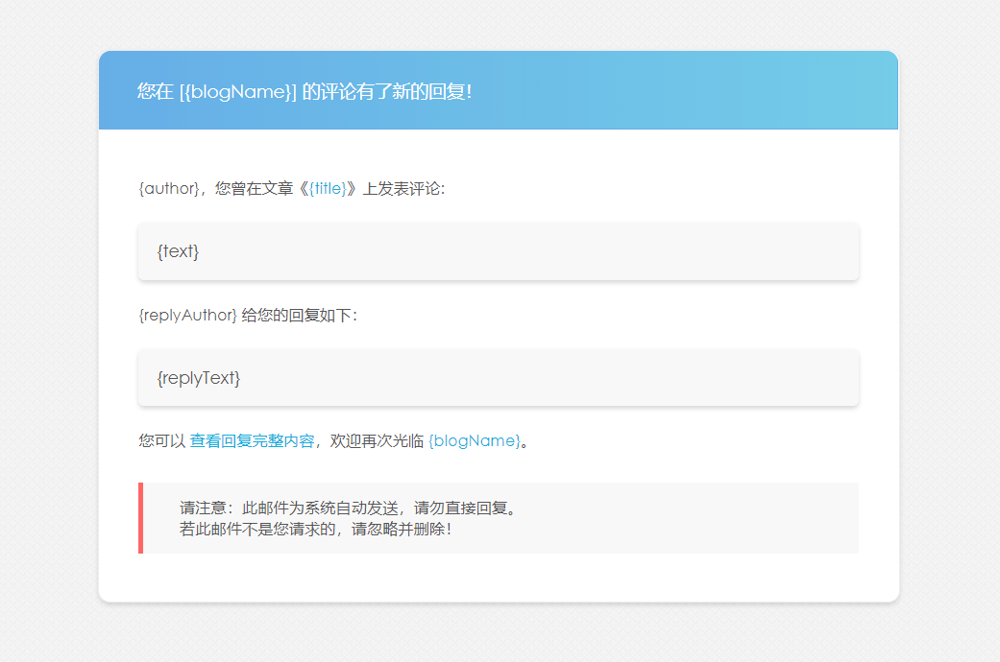

## 插件简介

Comment2Mail 是 Typecho 评论邮件通知插件，支持 SMTP、Mailgun 两种接口，其中 SMTP 接口采用非阻塞方式发送邮件

在评论审核通过、用户评论文章、用户评论被回复时发送邮件通知

## 安装方法

1. 至 [releases](https://github.com/ShadowySpirits/Comment2Mail/releases) 中下载最新版本插件，上传至网站的 /usr/plugins/ 目录下
2. 启用该插件，正确填写相关信息

## 自定义模板说明

插件共有三个模板，保存在 `theme` 目录下，分别为：

1. approved.html：邮件审核通过通知模板
2. author.html：文章评论通知模板
3. reply.html：评论回复通知模板

三个模板使用变量作为内容替换，您只需在自己的模板中增加相应的模板变量即可，模板变量列表如下：

### approved.html

1. {blogUrl}：博客地址
2. {blogName}：博客名称
3. {author}：评论者名称
4. {permalink}：文章链接
5. {title}：文章标题
6. {text}：评论内容

### author.html

1. {blogUrl}：博客地址
2. {blogName}：博客名称
3. {author}：评论者名称
4. {permalink}：文章链接
5. {title}：文章标题
6. {text}：评论内容

### reply.html

1. {blogUrl}：博客地址
2. {blogName}：博客名称
3. {author}：被回复者名称
4. {permalink}：文章链接
5. {title}：文章标题
6. {text}：被回复者评论内容
7. {replyAuthor}：回复者名称
8. {replyText}：回复内容